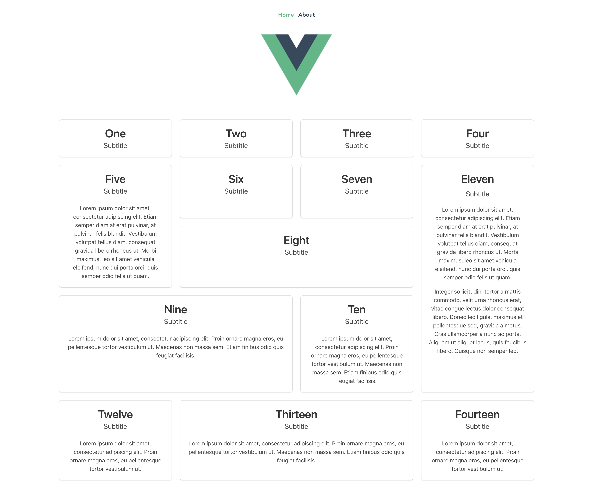

# Vue3 Buefy

## Project setup
```
yarn install
```

### Compiles and hot-reloads for development
```
yarn run serve
```

### Compiles and minifies for production
```
yarn run build
```

### Lints and fixes files
```
yarn run lint
```

### Run your unit tests
```
yarn run test:unit
```

### Run your end-to-end tests
```
yarn run test:e2e
```
